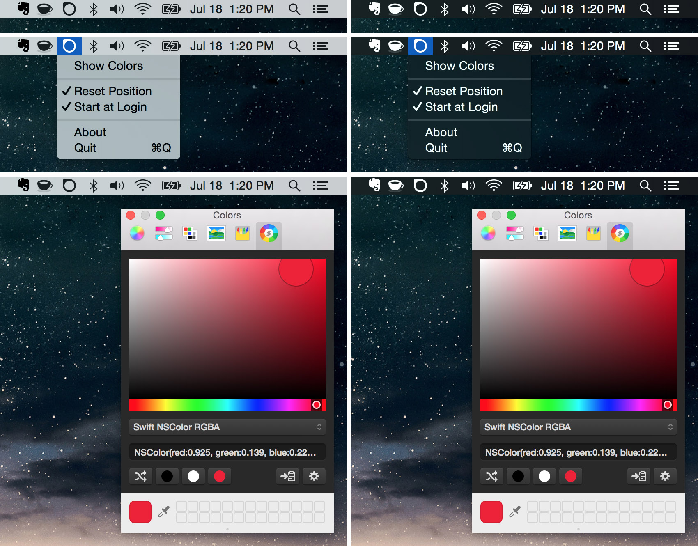

<h1 align="center">Menubar Colors</h1>

    
    
    

    <a href="#installation">Installation</a>
  • <a href="#how-do-you-use-this">Usage</a>
  • <a href="#recommended-plugins">Plugins</a>

## What is this?

This a utility that runs in the OS X menubar that allows for quick access to the
system-wide color panel.

## Installation

### Download

[Latest release](https://github.com/nvzqz/Menubar-Colors/releases/latest)

### Cask

`brew install menubar-colors --cask`

## How do you use this?

Left click toggles the color panel's visibility.  
Right click opens a drop down menu of options.

## Who is this for?

This utility was designed for designers and developers who need quick access to
the color panel. I chose to use the system color panel rather than make my own
because of how extensible it is.

## Recommended Plugins

### Skala Color

[Download](http://bjango.com/mac/skalacolor/)

Cask: `brew install colorpicker-skalacolor --cask`

### Antetype Color Picker

[Download](http://www.antetype.com/blog/2014/03/updated-antetype-color-picker-1-4-1/)

Cask: `brew install colorpicker-antetype --cask`

### Developer Color Picker

[Download](http://download.panic.com/picker/)

Cask: `brew install colorpicker-developer --cask`

## License

This project is licensed under the [MIT License](http://opensource.org/licenses/MIT).
Anyone is free to edit and improve the code here or use it for another project.

#### The MIT License (MIT)

Copyright (c) 2015 Nikolai Vazquez

Permission is hereby granted, free of charge, to any person obtaining a copy
of this software and associated documentation files (the "Software"), to deal
in the Software without restriction, including without limitation the rights
to use, copy, modify, merge, publish, distribute, sublicense, and/or sell
copies of the Software, and to permit persons to whom the Software is
furnished to do so, subject to the following conditions:

The above copyright notice and this permission notice shall be included in
all copies or substantial portions of the Software.

THE SOFTWARE IS PROVIDED "AS IS", WITHOUT WARRANTY OF ANY KIND, EXPRESS OR
IMPLIED, INCLUDING BUT NOT LIMITED TO THE WARRANTIES OF MERCHANTABILITY,
FITNESS FOR A PARTICULAR PURPOSE AND NONINFRINGEMENT. IN NO EVENT SHALL THE
AUTHORS OR COPYRIGHT HOLDERS BE LIABLE FOR ANY CLAIM, DAMAGES OR OTHER
LIABILITY, WHETHER IN AN ACTION OF CONTRACT, TORT OR OTHERWISE, ARISING FROM,
OUT OF OR IN CONNECTION WITH THE SOFTWARE OR THE USE OR OTHER DEALINGS IN
THE SOFTWARE.
